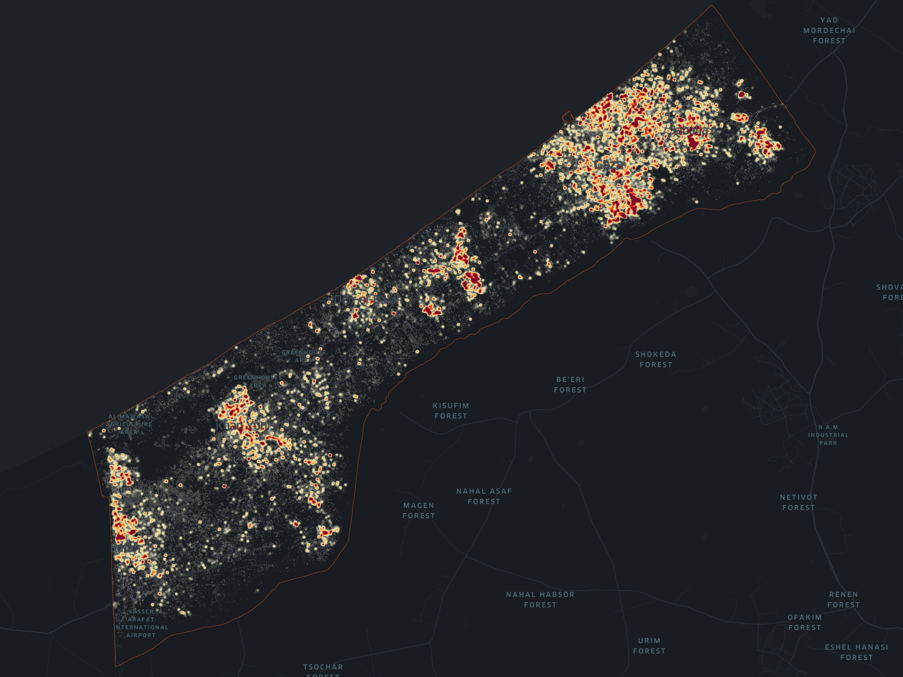
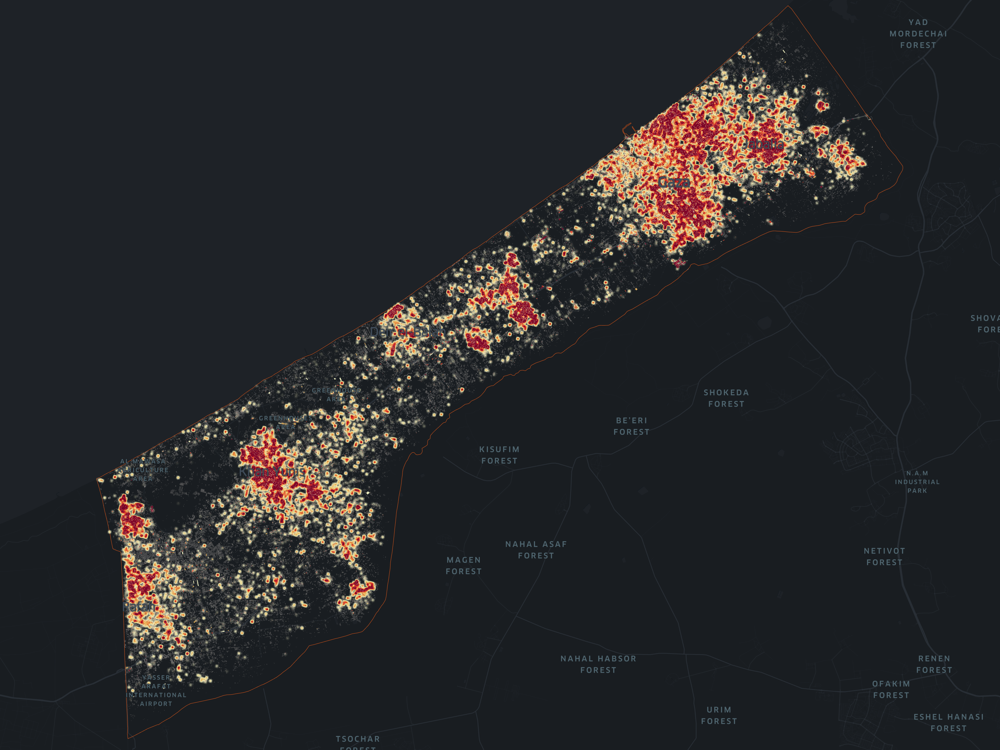
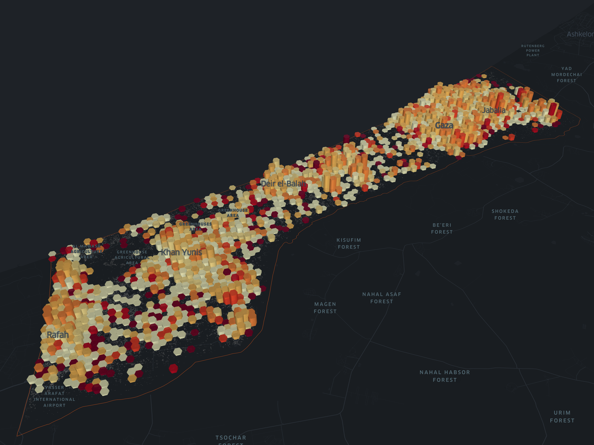
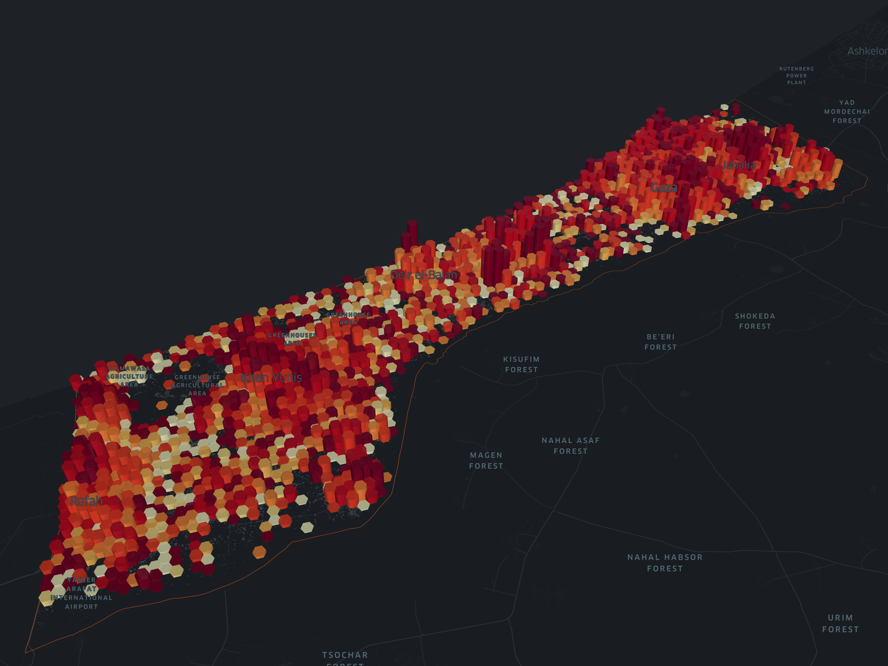

# Damage Assessment until February 2, 2024

This Damage Assessment report provides an overview of the current state of infrastructure and buildings damage as of **February 2, 2024**. Utilizing Synthetic Aperture Radar (SAR) imagery and buildings footprints from [OpenStreeMap](https://www.hotosm.org), we have generated the maps below to visualize the extent of damage across affected areas.

```{seealso}
Additionally, for a more immersive understanding, see also the [interactive map](https://studio.foursquare.com/public/26ba3dfb-0770-4cc6-b6fa-2ee2878580fc).
```

## Damage Assessment Heatmap

```{figure} heatmap-20231029.png
---
height: 500px
---
Heatmap depicting estimated damage inflicted to buildings until **October 29, 2023** in the Gaza Strip utilizing SAR imagery to evaluate the extent and geographical distribution of estimated destruction. Brighter regions indicate higher levels of damage, denoting the intensity of estimated damage on scale from 0 to 1, from yellow to red, where 1 signifies total damage. Source: OpenStreetMap, Sentinel-1 SAR and https://datapartnership.org/gaza-israel-conflict-impact-analysis.
```

```{figure} heatmap-20240202.png
---
height: 500px
---
Heatmap depicting estimated damage inflicted to buildings until **February 2, 2024** in the Gaza Strip utilizing SAR imagery to evaluate the extent and geographical distribution of estimated destruction. Brighter regions indicate higher levels of damage, denoting the intensity of estimated damage on scale from 0 to 1, from white to red, where 1 signifies total damage. Source: OpenStreetMap, Sentinel-1 SAR and https://datapartnership.org/gaza-israel-conflict-impact-analysis.
```

The following is a comparative visualization that contrasts the overall estimated damage between two significant time points: **October 29** and **February 2**. These dates mark the onset of the conflict and the most recent available update, enabling us to assess the evolving impact of the conflict over time.

|Estimated Damage until Oct 29, 2023 | Estimated Damage until Feb 2, 2024|
|- | -|
| | |

> Heatmap depicting estimated damage inflicted to buildings in the Gaza Strip utilizing SAR imagery to evaluate the extent and geographical distribution of estimated destruction. Brighter regions indicate higher levels of damage, denoting the intensity of estimated damage on scale from 0 to 1, from white to red, where 1 signifies total damage.

## Estimated Density and Intentisy of Damage to Buildings

```{figure} buildings-20231025_dark.png
---
height: 500px
---
Estimated damage inflicted to buildings until **October 29, 2023** in the Gaza Strip utilizing SAR imagery to evaluate the extent and geographical distribution of estimated destruction. Each bar represents a region, with height indicating the number of affected buildings and color denoting the intensity of estimated damage on scale from 0 to 1, from white to red, where 1 signifies total damage. Source: OpenStreetMap, Sentinel-1 SAR and https://datapartnership.org/gaza-israel-conflict-impact-analysis.
```

```{figure} buildings-20231216_dark.png
---
height: 500px
---
Estimated damage inflicted to buildings until **December 16, 2023** in the Gaza Strip utilizing SAR imagery to evaluate the extent and geographical distribution of estimated destruction. Each bar represents a region, with height indicating the number of affected buildings and color denoting the intensity of estimated damage on scale from 0 to 1, from white to red, where 1 signifies total damage. Source: OpenStreetMap, Sentinel-1 SAR and https://datapartnership.org/gaza-israel-conflict-impact-analysis.
```

```{figure} buildings-20240202_dark.png
---
height: 500px
---
Estimated damage inflicted to buildings until **February 2, 2024** in the Gaza Strip utilizing SAR imagery to evaluate the extent and geographical distribution of estimated destruction. Each bar represents a region, with height indicating the number of affected buildings and color denoting the intensity of estimated damage on scale from 0 to 1, from white to red, where 1 signifies total damage. Source: OpenStreetMap, Sentinel-1 SAR and https://datapartnership.org/gaza-israel-conflict-impact-analysis.
```

The following is a comparative visualization that contrasts the overall estimated damage between two significant time points: **October 29** and **February 2**. These dates mark the onset of the conflict and the most recent available update, enabling us to assess the evolving impact of the conflict over time.

|Estimated Damage until Oct 29, 2023 | Estimated Damage until Feb 2, 2024|
|- | -|
| | |

> Estimated damage inflicted to buildings in the Gaza Strip utilizing SAR imagery to evaluate the extent and geographical distribution of estimated destruction. Each bar represents a region, with height indicating the number of affected buildings and color denoting the intensity of estimated damage on scale from 0 to 1, from yellow to red, where 1 signifies total damage.

## Estimated Elapsed Days until High Damage

```{figure} elapsed-20240202_dark.png
---
height: 500px
---
Damage assessment as of **February 2, 2024** in the Gaza Strip utilizing SAR imagery to evaluate the extent and geographical distribution of estimated damage based on OpenStreetMap buildings. Each bar represents a region, with height indicating the number of affected buildings and color denoting the time elapsed from the onset of the conflict in October 7th, 2023 to reach high damage (least 0.75). In lighter red, high damage areas reached before December 2023; in darker red, after December 2023.
```
